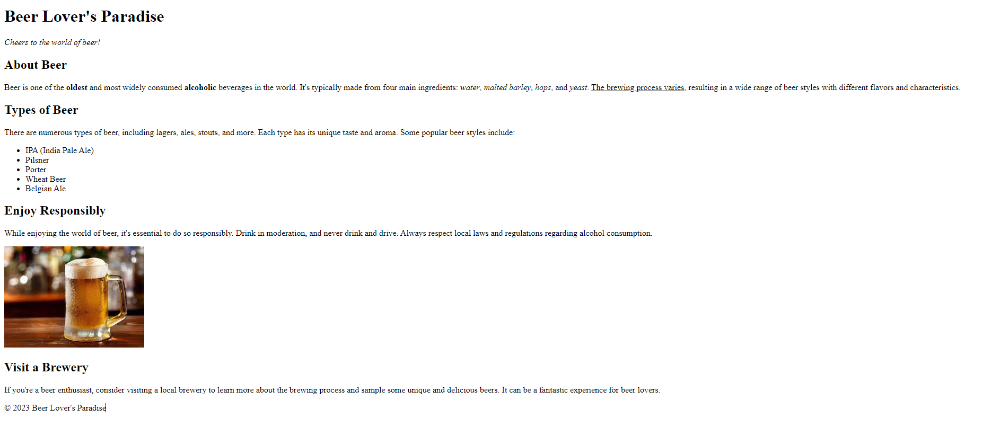

# html
Lásd el HTML tagekkel az alább megadott forrásszöveget a kép alapján!
Elvárt megoldás:

A `res` mappában `beerPage.PNG`-ként is megtalálod!

**FONTOS**: attól még, hogy HTML tag-eket írunk, az nem eredményez formázott oldalt,
minden böngészőnek (Chrome, Safari, stb.) van egy alapértelmezett formázása, ez az, amit
te ténylegesen látni fogsz ilyenkor.
A tényleges formázást majd a CSS fogja adni.

**Forrás szöveg:**

```
Beer Lover's Paradise

Cheers to the world of beer!

About Beer

Beer is one of the oldest and most widely consumed alcoholic beverages in the world. 
It's typically made from four main ingredients: water, malted barley, hops, and yeast. 
The brewing process varies, resulting in a wide range of beer styles with different flavors and characteristics.

Types of Beer

There are numerous types of beer, including lagers, ales, stouts, and more. 
Each type has its unique taste and aroma. Some popular beer styles include:

IPA (India Pale Ale)
Pilsner
Porter
Wheat Beer
Belgian Ale
Enjoy Responsibly

While enjoying the world of beer, it's essential to do so responsibly. 
Drink in moderation, and never drink and drive. Always respect local laws and regulations regarding alcohol consumption.

Visit a Brewery

If you're a beer enthusiast, consider visiting a local brewery to learn more about the brewing process 
and sample some unique and delicious beers. It can be a fantastic experience for beer lovers.

2023 Beer Lover's Paradise
```

